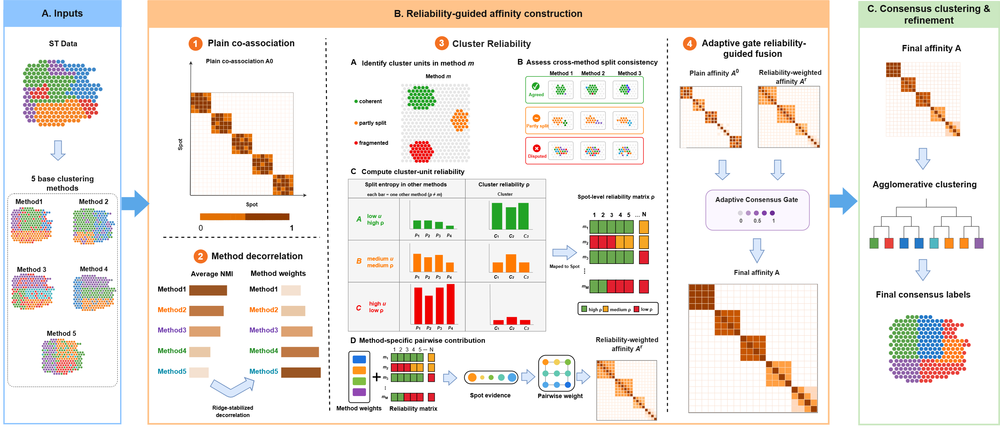

# TRUST-ST: Multi-Level Reliability-Guided Consensus Clustering for Spatial Transcriptomics

## Overview

Spatial-domain identification is a central task in spatial transcriptomics, yet existing methods vary widely in performance across tissue contexts because they rely on different modeling assumptions about gene expression, spatial continuity, and representation learning. Consensus clustering can integrate such complementary partitions, but treating every method and every cluster as equally reliable risks amplifying redundant or locally unstable evidence. We present TRUST-ST, a multi-level reliability-guided consensus clustering framework that models reliability at the levels of method redundancy, individual cluster units, and spot pairs rather than assigning a single global weight to each method. TRUST-ST combines Method Decorrelation, split-entropy-based Cluster Reliability, an Adaptive Consensus Gate that selectively corrects plain co-association evidence, and Conservative Spatial Refinement. On a benchmark comprising 12 human dorsolateral prefrontal cortex sections, TRUST-ST achieved the strongest average performance across four complementary clustering metrics. Evaluations on a human breast cancer section further showed improved agreement and spatially coherent partitions in heterogeneous disease tissues. Ablation analysis identified Cluster Reliability as the principal contributor to the average improvement, and a post hoc mechanism analysis showed that higher reliability scores were assigned to purer and less label-mixed cluster units. These results show that identifying reliable consensus evidence, rather than aggregating all votes uniformly, provides a robust route to spatial-domain inference across both anatomical and disease-oriented applications.

<p align="center">
  
</p>

This release contains only the reusable model implementation for reliability-guided consensus clustering. Dataset-specific runners, preprocessing scripts, benchmark notebooks, plotting utilities, and ablation execution code are intentionally excluded.

## Requirements

Core package versions used in the project environment are listed below.

```text
python==3.9
anndata==0.10.9
igraph==0.11.6
Jinja2==2.11.3
joblib==1.4.2
numba==0.60.0
numpy==1.26.3
opencv-python==4.10.0.84
pandas==2.2.3
pillow==10.2.0
POT==0.9.4
rpy2==3.5.11
scanpy==1.10.3
scikit-learn==1.5.2
scikit-misc==0.3.1
scipy==1.13.1
torch==2.0.1+cu118
torch-cluster==1.6.3+pt20cu118
torch-geometric==2.6.1
torch-scatter==2.1.2+pt20cu118
```

Install the Python dependencies with:

```bash
pip install -r requirements.txt
```

CUDA-specific PyTorch Geometric wheels should be installed from the wheel index matching the local PyTorch and CUDA versions.

## Repository Structure

```text
trustst/
├── __init__.py
└── model.py
assets/
└── model_architecture.png
requirements.txt
LICENSE
README.md
```

## Model Interface

The main interface is `TRUSTSTConsensus`:

```python
from trustst import TRUSTSTConsensus

model = TRUSTSTConsensus()
labels, affinity, diagnostics = model.fit(
    base_partitions=base_method_labels,
    spatial_coordinates=spatial_coordinates,
    n_clusters=num_domains,
)
```

`base_partitions` should contain one label vector per base method. `spatial_coordinates` should be an `n_spots × d` coordinate matrix, typically using two spatial coordinates. `n_clusters` is the target number of spatial domains.

## Core Components

- **Plain Co-association Baseline** constructs the equal-voting consensus affinity from the input base partitions.
- **Method Decorrelation** builds an NMI-based inter-method similarity matrix and solves a ridge-stabilized linear system to suppress redundant method evidence.
- **Cluster Reliability** treats every per-method cluster as a cluster unit and estimates its reliability from cross-method split entropy over its support set.
- **Reliability-weighted Affinity** combines method weights and inherited spot-level reliability to form pair-specific weighted co-association evidence.
- **Adaptive Consensus Gate** uses reliability dispersion and base conflict to decide how strongly reliability-weighted evidence should revise the plain co-association matrix.
- **Consensus Assignment** converts the gated affinity matrix into spatial-domain labels using average-linkage agglomerative clustering.
- **Conservative Spatial Refinement** corrects only low-confidence assignments when strong local neighborhood agreement supports the reassignment.

## Ablation Variants

The implementation exposes the standard component ablations used for analysis:

```python
from trustst import TRUSTSTConsensus

variants = TRUSTSTConsensus.ablation_variants()
```

The returned variants are `Full TRUST-ST`, `w/o Method Decorrelation`, `w/o Cluster Reliability`, `w/o Adaptive Consensus Gate`, and `w/o Spatial Refinement`.

## License

This project is released under the MIT License.
